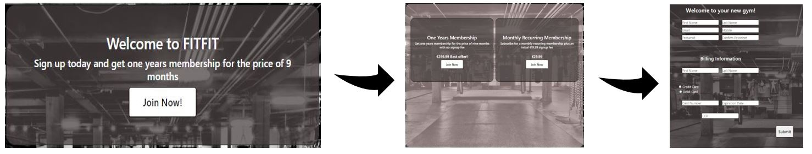
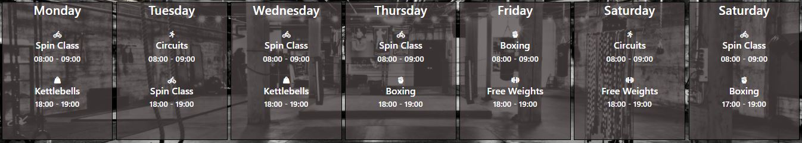
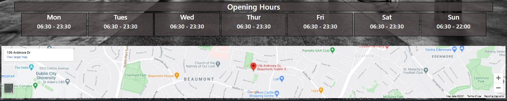
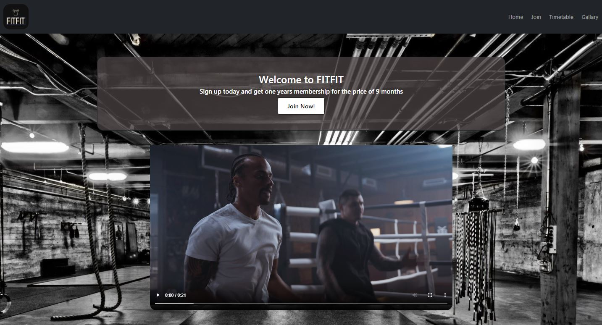
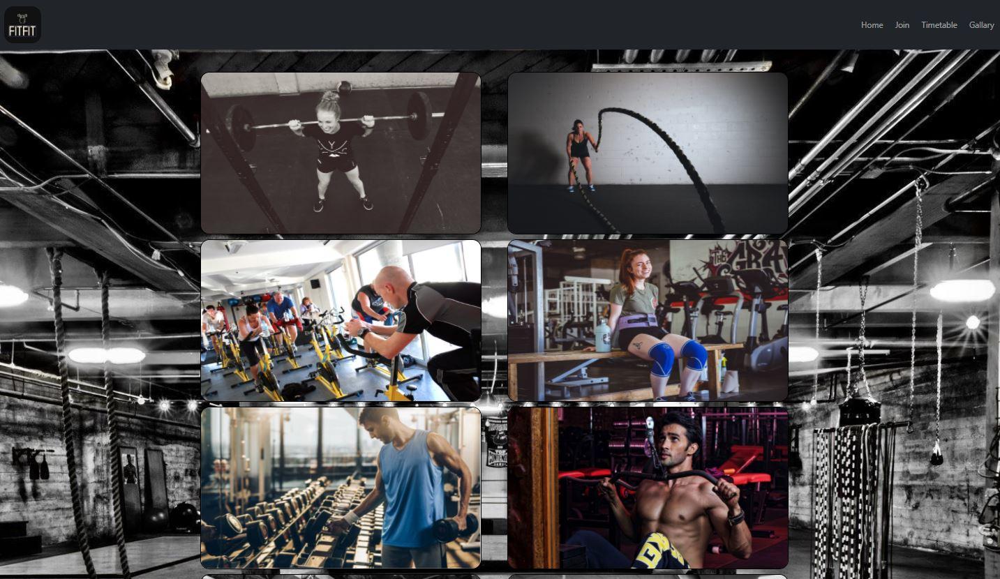
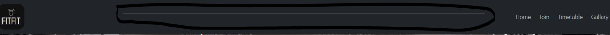
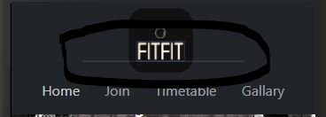
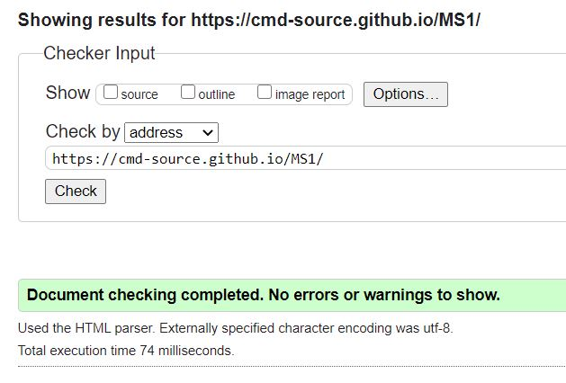
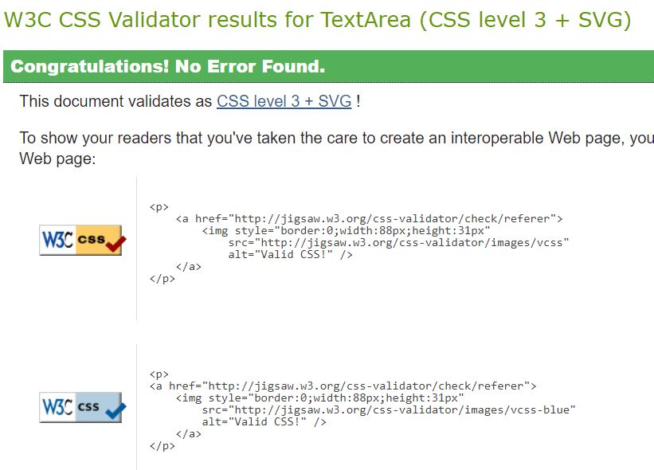

# First Milestone Project - FITFIT

### Table of Contents

1. UX

2. Features

3. Technologies Used

4. Testing 

5. Deployment

6. Credits

-------
## UX
### Project Goals

The main project goals for this developement are (1) For the sites owners to attract and retain customers to their gym website FITFIT. (2) For members of the gym and potential members who want to know more about the gym and its proceedures.

Owners goals
- Make it as easy as possible to sign up to the gym
- Make it as appealing as possible through attractive visuals
- Retain members through price value 

Members/Potential members goals
- To find a gym for the best price and to sign up as easily as possible
- To find the location and opening hours easily 
- To find a timetable of the classes available

### User Stories

As an owner of this gym website I want:

1. Ease of use for a potential gym member in being able to sign up from the moment they land on the site to the stage of signing up. Which means the website must flow from the landing page to the sign up page with minimum clicks needed.

2. For anyone who lands on the page to get the impression that this is a high quality gym and one that they would want to be part of. To make it as appealing as possible through attractive visuals.

3. To retain members for longer periods of time. This can be accomplished at the beginning through informative and obvious price value. It can then be maintained through clear opening times, contact details and obvious class times.

As a gym user/potential user I want:

1. To get the impression that I am dealing with a quality gym that will meet my needs. This means that I can come as I please to do my own workout or have the option to attend classes if I wish.

2. To be able to locate the gym and find its opening times easily. 

3. To know that I am getting value for my money. I also want to have the option to make a serious commitment in signing up for a long time or to have the option to sign up for shorter durations. This gives me flexibility.

4. Ease in signing up once I have decided that I like the look and feel of this gym. I should not have to struggle to find the sign up form.

### Design

When someone thinks of a gym or a place of physical fitness they imagine deep breathing, sweat, movement and physical edurance in a way that makes you feel a sense of accomplishment. With that in mind the following was selected to be part of the design:

### Images 
A strong background image was selected that immediately gives the immpressive of an areana for physical work to announce to the user that they are at the right place.

A gallary of images to show that all people of various types and exercises have a place here in FITFIT.

### Video

To give the sense that the user has already begun their workout with FITFIT, a short video with two men in a session of training was selected for the homepage. In order to give a positive emotion reaction.

### Styling

The theme of colours for this site is dark, grey and white. It was selected as it gives the user an impression that this is a serious place where serious physical accomplishments are made.

The default font of system-ui was used as it gave a solid impression and it was very readable for each page.

### Wireframes

Balsamiq was used to create the following wireframes for 

- [The homepage](assets/wireframes/homepagewire.PNG)
- [The membership page](assets/wireframes/membershipwire.PNG)
- [The joining form](assets/wireframes/joiningformwire.PNG)
- [The timetable](assets/wireframes/timetablewire.PNG)
- [The gallary](assets/wireframes/gallarywire.PNG)

-------

## Features

Included
 - A fixed nav-bar at the top of the page allows the user to navigate easily no matter what part of a page they may be on.
 - A footer at the bottom of the page allows the user to contact the site owners and also provides the links to their social media.
 - The location on Google Maps was included at the bottom of the homepage to allow the user to easily locate the FITFIT gym.
 - A video on the homepage was inserted to give the user a positive emotional response.
 - A signup form has been inserted which is the end goal for new users coming to the FITFIT site. The input fields call for the users personal info and payment details.
 - There are a number of mid sized buttons which first call to the user leading them from the homepage, through the choice between the two membership options and finally to the signup page.
 - A gallary page was inserted to highlight the accomplishments that others have made to entice new users.
 
 
Not Included
 - Autoplay audio/music was considered for the homepage, but after review it was considered to be too annoying and would actually take away from the experience when the user first lands.
 - For future developement it might add a more personal experience to include a page on the site for the purpose of introducing the trainers and the FITFIT team.
-------

## Technologies Used

#### Languages Used
- Html5 was used to provide the structure to the website.
- CSS3 was used to provide the style to the website.

#### Frameworks Used
- Bootstrap 5.0 was used as it allows the use of pre made style structures to the site.
- Font Awesome was used on the timetable page for the use of its icons to add a bit more substance and feel to the page.

-------

## Testing The FITFIT Website

### Homepage

##### For Desktop / Tablet
 1. The homepage displays as intended when the user first lands with the call to action in the form of Join Now button working correctly. The Join Now button transitions to the membership options.
 2. The nav-bar operates as intended with each element highlighted when the user hovers over them.
 3. A clear call to action incites the user to join the gym and the Join Now button transitions in its annimation when the user hovers.
 4. The video displays with the control panal but it can take a few moments to play when the play button is pressed. 
 5. My Google Maps iframe would not pass the html validator initially. I solved it by reading and modifying the code with the help from [OSTraining](https://www.ostraining.com/blog/coding/responsive-google-maps/)

##### For Mobile
 1. The homepage displays when the user first lands with the call to action also working correctly in transitioning to the membership page.
 2. The nav-bar positions under the logo on the mobile version as intended, with each element highlighted when the user hovers over each of the nav elements.
 3. The homepage appears as intended with the video being hidden and the Opening Hours section collapsing into vertical allignment.

### Join page

##### For Desktop / Tablet
 1. Click on the Join Now button on the Hompage.
 2. The options for either One Years Membership or Monthly Recurring Membership present well side by side on the desktop. For the tablet them stack on top of each other.
 3. Both Join Now buttons display and transition in their annimation as intended when the user hovers over them.

 ##### For Mobile
 1. The options for either One Years Membership or Monthly Recurring Membership stack on top of each other in the mobile version. 
 2. The membership options display well to the user in the transition from destop to tablet to mobile.
 3. Both options display as originally intended from the wireframes.
 4. Both Join Now buttons display and transition in their annimation as intended when the user hovers over them.

### Sign up form
##### For Desktop / Tablet
 1. Click the Join Now button from the Join page.
 2. The user is then transitioned to the sign up form for the users details.
 3. This appears in two columns on the desktop and one on a tablet. 
 4. All the fields have the correct inputs, meaning the name fields except text, the email field needs an @ symbol and the mobile field needs digits.
 5. Input fields have place holders for the info they are intended for, fields are required before the submit button can be selected.
 6. The submit button does action a submit but I do not yet get a successful submit page. *Still investigating this.
 7. The navbar had a small bug. The result of this bug was that a white line would cut through the navbar. It was solved by giving the navbar a Z index of 1.

 

##### For Mobile
 1. Click the Join Now button from the Join page.
 2. The sign up form is presented in one column and visually flows well down to the submit button.
 3. All the fields have the correct inputs and are required just like the desktop.
 4. The submit button does action a submit but I do not yet get a successful submit page. *Still investigating this.
 5. As on the desktop version the The navbar had a small bug. The result of this bug was that a white line would cut through the navbar. It was solved by giving the navbar a Z index of 1.

 ### Timetable page
 ##### For Desktop / Tablet
 1. Click on the Timetable in the nav-bar
 2. The Timetable displays as intended on desktop with each day of the week showing side by side in parallel.
 3. On a tablet the days of the week stack on top of each other as intended.
 4. The classes available to the user are clear and obvious with the help of fontawesome's visual icons.

 ##### For Mobile
 1. Click on the Timetable in the nav-bar
 2. Like the tablet the days of the week stack on top of each other as intended.
 3. Again, the classes available to the user are clear and obvious with the help of fontawesome's visual icons.

### Gallary page
##### For Desktop / Tablet
 1. Click on the Gallary in the nav-bar.
 2. The images render well on the desktop in two columns.
 3. The two columns switch to one colum when viewing on a tablet in order to avoid image stretching.
 4. The images viewed provide an impression of work and enjoyment.

##### Moblie
 1. Click on the Gallary in the nav-bar
 2. The images render well on the mobile in one column. They did initially lean to the right but this has been fixed through a padding/margin CSS correction.
 3. Again, the images viewed provide an impression of work and enjoyment.

### Browsers

Website was tested on the below browsers

- Microsoft Edge
- Google Chrome
- Mozzila

### Devices

Website was tested on:
 
 - 24 inch desktop dell screen
 - Lenovo Laptop 
 - Galaxy S5
 - Pixel 2
 - iPhone 5
 - iPhone 6/7/8/10
 - iPad
 - Surface Duo
 - Galaxy fold

The website rendered well across most devices the apart from the iPhone 5 and Galaxy fold. On the iPhone 5 and Galaxy fold each element on the navbar did not present horizontally as it did on every other mobile device. On the Galaxy fold I had an overflow problem on the Join and Signup pages. It is an issue that I will have to improve upon in the future for these 2 devices. 

###Validators
The website passed both the HTML and CSS validators as shown below

-------

## Deployment

#### How to deploy this project:

1. Create a github account.
2. Install the Gitpod extention.
3. Navigate to the repository where the project is stored.
4. Click on the green Gitpod button to create a workplace where the project can be worked on.

#### How to clone and deploy this project:

1. Navigate to the repository where the project is stored.
2. Click on the Code button which will give the option to download the contect and the url.
3. Copy the url.
4. In your chosen IDE in the terminal type "git clone (followed by the copied url).

-------

## Credits

#### Content

The nav-bar for this website was taken from [Bootstrap](https://getbootstrap.com/) and slightly altered

#### Media

The FITFIT logo was made using [Looka](https://looka.com/logo-maker/) 

The background image for all pages was taken from [wallpaperaccess](https://wallpaperaccess.com/full/1087589.jpg)

The video on the Homepage was taken from [Pexels](https://www.pexels.com/video/two-men-doing-cardio-exercises-4761431/)

The icons for the page Timetable were taken form [Font-awesome](https://fontawesome.com/)

The images for the Gallary page were taken from the below links:

- [photo1](https://unsplash.com/photos/l9Z19qt576c)
- [photo2](https://unsplash.com/photos/U5kQvbQWoG0)
- [photo3](https://unsplash.com/photos/XqAhTH3EBnw)
- [photo4](https://pixnio.com/sport/training-workout-fitness-gym-sport-motion)
- [photo5](https://unsplash.com/photos/dr0TJa-zYQo)
- [photo6](https://upload.wikimedia.org/wikipedia/commons/b/b4/Cycle_Class_at_a_Gym.JPG)
- [photo7](https://pxhere.com/en/photo/903193)
- [photo8](https://pxhere.com/en/photo/1187251)
- [photo9](https://www.muscleandfitness.com/workouts/workout-tips/7-advantages-dumbbell-training/)
- [photo10](https://pixabay.com/photos/fitness-strengthening-muscles-gym-3502830/)

#### Acknowledgements

I did get help and influence from [W3s](https://www.w3schools.com/), [Stackoverflow](https://stackoverflow.com/questions/15219506/google-map-validation) and from the Irish low cost gym [Flyfit](https://www.flyefit.ie/).
